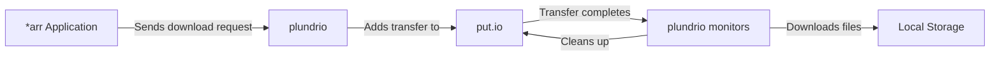

<h1>🌊 plundrio</h1>

<p align="center">
<br/><br/>
<i>
Sailing the digital seas with ease,<br/>
Fetching treasures as we please.<br/>
With *arr at helm and put.io's might,<br/>
Downloads flow through day and night.
</i>
<br/><br/>
</p>

plundrio (`/ˈplʌndriˌoʊ/`) is a put.io download client designed to seamlessly
integrate with the *arr stack (Sonarr, Radarr, Lidarr, etc.). Files are
automatically added to put.io and downloaded to the local disk once complete.

<h2>📋 Table of Contents</h2>

- [🚀 Features](#-features)
- [🔧 How It Works](#-how-it-works)
- [📋 Prerequisites](#-prerequisites)
- [📦 Installation](#-installation)
  - [Using Go](#using-go)
  - [Using NixOS](#using-nixos)
  - [Using Docker](#using-docker)
  - [From Releases](#from-releases)
- [🚀 Getting Started](#-getting-started)
  - [1. Obtain a put.io OAuth Token](#1-obtain-a-putio-oauth-token)
  - [2. Generate a Configuration File (Optional)](#2-generate-a-configuration-file-optional)
  - [3. Configure Your Download Directory](#3-configure-your-download-directory)
  - [4. Start plundrio](#4-start-plundrio)
  - [5. Configure Your \*arr Application](#5-configure-your-arr-application)
- [⚙️ Configuration](#️-configuration)
  - [Configuration Priority](#configuration-priority)
- [🔌 Configuring \*arr Applications](#-configuring-arr-applications)
- [🎮 Commands](#-commands)
  - [Run the download manager](#run-the-download-manager)
  - [Generate configuration file](#generate-configuration-file)
  - [Get OAuth token](#get-oauth-token)
- [💡 Tips \& Optimization](#-tips--optimization)
- [🔍 Troubleshooting](#-troubleshooting)
  - [Common Issues](#common-issues)
- [❓ Frequently Asked Questions](#-frequently-asked-questions)
- [🤝 Contributing](#-contributing)
- [📜 License](#-license)

## 🚀 Features

- 🔄 Seamless integration with Sonarr, Radarr, and other *arr applications
  supporting Transmission RPC
- 🌐 Stateless architecture; multiple instances per put.io account supported
- ⚡ Fast and efficient downloads from put.io (with resume support)
- 🔄 Parallel downloads with configurable worker count to maximize bandwidth
- 🛠️ Easy configuration and setup with multiple configuration methods
- 🧹 Automatic cleanup of completed transfers
- 🔒 Secure OAuth token handling for put.io authentication

## 🔧 How It Works

plundrio makes downloading from put.io simple and automatic:



1. Your *arr application sends a download request to plundrio via Transmission RPC
2. plundrio forwards this request to put.io
3. plundrio tracks all put.io transfers pointing at the specified target directory
4. Once a transfer completes, it automatically downloads all files to your local folder
5. Downloads are parallelized with multiple workers to optimize speed
6. Transfers and their files are cleaned up when all files are present locally and the transfer finished seeding

## 📋 Prerequisites

Before installing plundrio, ensure you have:

1. **put.io Account**: An active put.io subscription
2. **OAuth Token**: A valid put.io OAuth token (instructions for obtaining below)
3. **Storage Space**: Sufficient disk space for your downloads
4. **Network Bandwidth**: Adequate bandwidth for parallel downloads
5. **One or more *arr Applications**: Sonarr, Radarr, Lidarr, etc. (optional, but recommended)

## 📦 Installation

### Using Go

```bash
go install github.com/elsbrock/plundrio/cmd/plundrio@latest
```

### Using NixOS

plundrio can be integrated directly into your NixOS configuration as a service:

```nix
{
  inputs = {
    nixpkgs.url = "github:NixOS/nixpkgs/nixos-unstable";
    plundrio.url = "github:elsbrock/plundrio";
  };

  outputs = { self, nixpkgs, plundrio, ... }: {
    nixosConfigurations.mySystem = nixpkgs.lib.nixosSystem {
      system = "x86_64-linux";
      modules = [
        plundrio.nixosModules.default
        {
          services.plundrio = {
            enable = true;
            targetDir = "/var/lib/plundrio/downloads";
            putioFolder = "plundrio";
            oauthToken = "your-oauth-token";
            # Optional configurations with defaults:
            # listenAddr = ":9091";
            # workerCount = 4;
            # logLevel = "info";
            # user = "plundrio";
            # group = "plundrio";
          };
        }
      ];
    };
  };
}
```

The NixOS module:
- Creates a dedicated system user and group (plundrio)
- Sets up a systemd service with proper security hardening
- Creates the target directory with appropriate permissions
- Automatically starts at boot and restarts on failure

### Using Docker

```bash
docker run --rm -it ghcr.io/elsbrock/plundrio:latest -- --help
```

Make sure to expose the transmission RPC port (default 9091) and mount the download directory:

```bash
docker run -d \
  --name plundrio \
  -p 9091:9091 \
  -v /path/to/downloads:/downloads \
  -e PLDR_TOKEN=your-token \
  -e PLDR_TARGET=/downloads \
  -e PLDR_FOLDER=plundrio \
  ghcr.io/elsbrock/plundrio:latest
```

### From Releases

Download the latest binary for your platform from the [releases page](https://github.com/elsbrock/plundrio/releases). We provide packages and Docker images for both x86_64-linux and aarch64-linux platforms.

## 🚀 Getting Started

### 1. Obtain a put.io OAuth Token

```bash
plundrio get-token
```

This will guide you through the OAuth authentication process and provide you with a token.

### 2. Generate a Configuration File (Optional)

```bash
plundrio generate-config
```

This creates a template configuration file that you can customize.

### 3. Configure Your Download Directory

Edit your configuration file or set environment variables to specify your download directory and put.io folder.

### 4. Start plundrio

```bash
plundrio run \
  --target /path/to/downloads \
  --folder "plundrio" \
  --token YOUR_PUTIO_TOKEN \
  --workers 4
```

### 5. Configure Your *arr Application

Add plundrio as a Transmission download client in your *arr application (see [Configuring *arr Applications](#-configuring-arr-applications) below).

## ⚙️ Configuration

plundrio supports multiple configuration methods:

1. **Config file** (YAML format):

```yaml
target: /path/to/downloads     # Target directory for downloads
folder: "plundrio"             # Folder name on put.io
token: ""                      # Put.io OAuth token (prefer env var)
listen: ":9091"                # Transmission RPC server address
workers: 4                     # Number of download workers
log_level: "info"              # Log level (trace,debug,info,warn,error,fatal,panic,none,pretty)
```

2. **Command-line flags** (see full list with `plundrio run --help`)

3. **Environment variables** (prefixed with `PLDR_`):

```bash
export PLDR_TARGET=/path/to/downloads
export PLDR_TOKEN=your-putio-token
export PLDR_FOLDER=plundrio
export PLDR_LISTEN=:9091
export PLDR_WORKERS=4
export PLDR_LOG_LEVEL=info
```

### Configuration Priority

Configuration values are loaded in the following order, with later sources overriding earlier ones:

1. Default values
2. Configuration file
3. Environment variables
4. Command-line flags

💡 **Security Note**: Store OAuth tokens in environment variables rather than config files or command-line arguments for better security.

## 🔌 Configuring *arr Applications

To add plundrio to your *arr application (Sonarr, Radarr, etc.):

1. Go to Settings > Download Clients
2. Click the + button to add a new client
3. Select "Transmission" from the list
4. Fill in the following details:
   - Name: plundrio (or any name you prefer)
   - Host: localhost (or your server IP)
   - Port: 9091 (or your configured port)
   - URL Base: leave empty
   - Username: leave empty
   - Password: leave empty
5. Click "Test" to verify the connection
6. Save if the test is successful

plundrio will now automatically handle downloads from your *arr application through put.io.

## 🎮 Commands

### Run the download manager

```bash
plundrio run \
  --target /path/to/downloads \
  --folder "plundrio" \
  --token YOUR_PUTIO_TOKEN \
  --workers 4
```

### Generate configuration file

```bash
plundrio generate-config
```

### Get OAuth token

```bash
plundrio get-token
```

## 💡 Tips & Optimization

- **Trash Bin Management**: We recommend turning off the trash bin in your put.io settings. This helps keep your put.io account clean and saves space. The trash cannot be deleted programmatically.

- **Download Speed Optimization**: Downloads are throttled by put.io to 20MB/s per connection. This means that if you have multiple downloads running at the same time, they will each download at 20MB/s. The default worker count of 4 allows up to 80MB/s total throughput.

- **Worker Count Tuning**:
  - For faster internet connections (100Mbps+), consider increasing worker count to 5-8
  - For slower connections, reduce worker count to 2-3 to avoid bandwidth saturation
  - Monitor system resource usage to find the optimal setting for your environment

- **Automatic Downloads**: If you set the default download folder of put.io to the folder configured in plundrio, you can automatically download files added through other means (e.g., via chill.institute).

- **Security Best Practices**:
  - Use environment variables for sensitive data like OAuth tokens
  - Consider using Docker secrets or a secure environment variable manager in production
  - Regularly rotate your OAuth tokens for enhanced security

## 🔍 Troubleshooting

### Common Issues

1. **Connection Refused**
   - Ensure plundrio is running and the port (default 9091) is not blocked by a firewall
   - Verify the correct host/IP is configured in your *arr application

2. **Authentication Failures**
   - Regenerate your OAuth token using `plundrio get-token`
   - Check that the token is correctly set in your configuration

3. **Download Issues**
   - Verify your target directory is writable
   - Check available disk space
   - Ensure your put.io account is active and has the files available

4. **Performance Problems**
   - Adjust worker count based on your bandwidth and system capabilities
   - Check for network throttling or limitations

## ❓ Frequently Asked Questions

**Q: Can I use plundrio without *arr applications?**
A: Yes, plundrio will monitor and download any transfers in your configured put.io folder, regardless of how they were added.

**Q: How does plundrio compare to the official put.io client?**
A: plundrio focuses on automation and integration with *arr applications, while the official client offers a more general-purpose interface.

**Q: Can I run multiple instances of plundrio?**
A: Yes, plundrio is stateless and can be run in multiple instances, even pointing to the same put.io account with different configurations.

**Q: Does plundrio support VPNs or proxies?**
A: plundrio uses your system's network configuration. If your system routes through a VPN or proxy, plundrio will use that connection.

**Q: How can I monitor plundrio's status?**
A: plundrio logs its activities to stdout. You can redirect these logs to a file or use a log management system.

## 🤝 Contributing

Contributions to plundrio are welcome! Here's how you can contribute:

1. **Code Contributions**:
   - Fork the repository
   - Create a feature branch
   - Make your changes
   - Submit a pull request

2. **Bug Reports**:
   - Open an issue describing the bug
   - Include steps to reproduce
   - Provide system information

3. **Feature Requests**:
   - Open an issue describing the feature
   - Explain the use case and benefits

4. **Documentation**:
   - Help improve the README
   - Add examples or tutorials

Please open an issue first to discuss what you would like to change for major features or changes.

## 📜 License

This project is licensed under the MIT License - see the [LICENSE](LICENSE) file for details.
