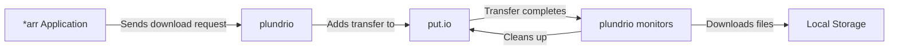

<h1>🌊 plundrio</h1>

<p align="center">
<br/><br/>
<i>
Sailing the digital seas with ease,<br/>
Fetching treasures as we please.<br/>
With *arr at helm and put.io's might,<br/>
Downloads flow through day and night.
</i>
<br/><br/>
</p>

plundrio (`/ˈplʌndriˌoʊ/`) is a put.io download client designed to seamlessly
integrate with the *arr stack (Sonarr, Radarr, Lidarr, etc.). Files are
automatically added to put.io and downloaded to the local disk once complete.

By using plundrio, you can benefit from faster downloads if the file is
already cached by put.io, allowing you to download it locally immediately. This
is especially useful if you have a low bandwidth connection, as you can easily
saturate it by downloading from put.io instead of the original source.
Additionally, if put.io already has the file cached, you can skip the initial
download step from the origin to put.io, saving time and bandwidth. However, in
all other cases, a direct download from the origin may be more beneficial, as
put.io essentially performs the same download process.

<h2>📋 Table of Contents</h2>

- [🚀 Features](#-features)
- [🔧 How It Works](#-how-it-works)
  - [Transfer State Tracking for \*arr Integration](#transfer-state-tracking-for-arr-integration)
- [📋 Prerequisites](#-prerequisites)
- [📦 Installation](#-installation)
  - [Using Go](#using-go)
  - [Using NixOS](#using-nixos)
  - [Using Docker](#using-docker)
  - [From Releases](#from-releases)
- [🚀 Getting Started](#-getting-started)
  - [1. Obtain a put.io OAuth Token](#1-obtain-a-putio-oauth-token)
  - [2. Generate a Configuration File (Optional)](#2-generate-a-configuration-file-optional)
  - [3. Configure Your Download Directory](#3-configure-your-download-directory)
  - [4. Start plundrio](#4-start-plundrio)
  - [5. Configure Your \*arr Application](#5-configure-your-arr-application)
- [⚙️ Configuration](#️-configuration)
  - [Configuration Priority](#configuration-priority)
- [🔌 Configuring \*arr Applications](#-configuring-arr-applications)
- [🎮 Commands](#-commands)
  - [Run the download manager](#run-the-download-manager)
  - [Generate configuration file](#generate-configuration-file)
  - [Get OAuth token](#get-oauth-token)
- [💡 Tips \& Optimization](#-tips--optimization)
- [🔍 Troubleshooting](#-troubleshooting)
  - [Common Issues](#common-issues)
- [❓ Frequently Asked Questions](#-frequently-asked-questions)
- [🤝 Contributing](#-contributing)
- [📜 License](#-license)

## 🚀 Features

- 🔄 Seamless integration with Sonarr, Radarr, and other *arr applications
  supporting Transmission RPC
- 🌐 Stateless architecture; multiple instances per put.io account supported
- ⚡ Fast and efficient downloads from put.io (with resume support)
- 🔄 Parallel downloads with configurable worker count to maximize bandwidth
- 🧹 Automatic cleanup of completed transfers
- 🔒 Secure OAuth token handling for put.io authentication
- 📊 Comprehensive transfer logging with detailed metadata for all transfers
- 🔁 Automatic retry of failed transfers with configurable retry attempts

## 🔧 How It Works

plundrio makes downloading from put.io simple and automatic:


```mermaid
graph LR
    A[*arr Application] -->|Sends download request| B[plundrio]
    B -->|Adds transfer to| C[put.io]
    C -->|Transfer completes| D[plundrio monitors]
    D -->|Downloads files| E[Local Storage]
    D -->|Cleans up| C
```

1. Your *arr application sends a download request to plundrio via Transmission RPC
2. plundrio forwards this request to put.io
3. plundrio tracks all put.io transfers pointing at the specified target directory
4. Once a transfer completes, it automatically downloads all files to your local folder
5. Downloads are parallelized with multiple workers to optimize speed
6. Transfers and their files are cleaned up when all files are present locally and the transfer finished seeding

### Transfer State Tracking for *arr Integration

plundrio implements a specialized state tracking system to ensure seamless integration with *arr applications:

1. **Transfer Record Preservation**:
   - When a transfer completes and files are downloaded, plundrio removes the files from put.io but keeps the transfer record
   - This transfer record acts as a central entity that *arr applications can query to determine completion status
   - Transfers are only fully removed when explicitly requested via torrent-remove RPC call

2. **Progress Calculation**:
   - put.io download progress (0-100%) is mapped to 0-50% of the total progress
   - Local download progress (0-100%) is mapped to 50-100% of the total progress
   - For transfers being processed: progress = (put.io_progress / 2) + (local_progress * 0.5)
   - For completed transfers: progress = 100% with "seeding" status
   - This two-phase progress tracking gives *arr applications accurate visibility into both remote and local download status

3. **Completed-transfer removal**:
   - Only locally processed transfers report that their per-torrent idle limit has been reached, allowing *arr to request removal after import.
   - `seedRatioMode: 2` reports unlimited seeding and overrides the ratio goal configured in *arr, because put.io owns seeding. Plundrio uses the idle-limit fields to signal removability instead.

This approach ensures reliable integration with *arr applications while optimizing put.io storage usage.

## 📋 Prerequisites

Before installing plundrio, ensure you have:

1. **put.io Account**: An active put.io subscription
2. **OAuth Token**: A valid put.io OAuth token (instructions for obtaining below)
3. **Storage Space**: Sufficient disk space for your downloads
4. **Network Bandwidth**: Adequate bandwidth for parallel downloads
5. **One or more *arr Applications**: Sonarr, Radarr, Lidarr, etc. (optional, but recommended)

## 📦 Installation

### Using Go

```bash
go install github.com/elsbrock/plundrio/cmd/plundrio@latest
```

### Using NixOS

plundrio can be integrated directly into your NixOS configuration as a service:

```nix
{
  inputs = {
    nixpkgs.url = "github:NixOS/nixpkgs/nixos-unstable";
    plundrio.url = "github:elsbrock/plundrio";
  };

  outputs = { self, nixpkgs, plundrio, ... }: {
    nixosConfigurations.mySystem = nixpkgs.lib.nixosSystem {
      system = "x86_64-linux";
      modules = [
        plundrio.nixosModules.default
        {
          services.plundrio = {
            enable = true;
            targetDir = "/var/lib/plundrio/downloads";
            putioFolder = "plundrio";
            authTokenFile = "/run/credentials/plundrio.service/token";
            # Optional configurations with defaults:
            # listenAddr = ":9091";
            # workerCount = 4;
            # logLevel = "info";
            # user = "plundrio";
            # group = "plundrio";
          };
        }
      ];
    };
  };
}
```

The NixOS module:
- Creates a dedicated system user and group (plundrio)
- Sets up a systemd service with proper security hardening
- Creates the target directory with appropriate permissions
- Automatically starts at boot and restarts on failure

### Using Docker

```bash
docker run --rm -it ghcr.io/elsbrock/plundrio:latest -- --help
```

Make sure to expose the transmission RPC port (default 9091) and mount the download directory:

```bash
docker run -d \
  --name plundrio \
  -p 9091:9091 \
  -v /path/to/downloads:/downloads \
  -e PLDR_TOKEN=your-token \
  -e PLDR_TARGET=/downloads \
  -e PLDR_FOLDER=plundrio \
  ghcr.io/elsbrock/plundrio:latest
```

The Docker image is available for both x86_64 and ARM64 architectures. Docker will automatically pull the correct version for your platform.

### From Releases

Download the latest binary package for your platform (x86_64-linux or aarch64-linux) from the [releases page](https://github.com/elsbrock/plundrio/releases). The multi-arch Docker image is available on GHCR (see [Using Docker](#using-docker)).

## 🚀 Getting Started

### 1. Obtain a put.io OAuth Token

```bash
plundrio get-token
```

This will guide you through the OAuth authentication process and provide you with a token.

### 2. Generate a Configuration File (Optional)

```bash
plundrio generate-config
```

This creates a template configuration file that you can customize.

### 3. Configure Your Download Directory

Edit your configuration file or set environment variables to specify your download directory and put.io folder.

### 4. Start plundrio

```bash
plundrio run \
  --target /path/to/downloads \
  --folder "plundrio" \
  --token YOUR_PUTIO_TOKEN \
  --workers 4
```

### 5. Configure Your *arr Application

Add plundrio as a Transmission download client in your *arr application (see [Configuring *arr Applications](#-configuring-arr-applications) below).

## ⚙️ Configuration

plundrio supports multiple configuration methods:

1. **Config file** (YAML format):

```yaml
target: /path/to/downloads     # Target directory for downloads
folder: "plundrio"             # Folder name on put.io
token: ""                      # Put.io OAuth token (prefer env var)
listen: ":9091"                # Transmission RPC server address
workers: 4                     # Number of download workers
use-categories-target: false   # Put local downloads into per-category subfolders (e.g. <target>/tv)
use-categories-putio: false    # Create per-category subfolders on put.io (e.g. <folder>/tv)
stalled-transfer-timeout: 6h   # Report unchanged Put.io downloads after this duration (0 disables)
download_start_window:         # Optional local download start window
  enabled: false
  start: "23:00"
  end: "05:00"
log_level: "info"              # Log level (trace,debug,info,warn,error,fatal,panic,none,pretty)
```

`stalled-transfer-timeout` tracks the downloaded byte count of each Put.io transfer. The default is `6h`; set it to `0` to disable detection. Unchanged bytes in `DOWNLOADING` produce Transmission error `3` (`TR_STAT_LOCAL_ERROR`). This deliberately lets Sonarr/Radarr treat the transfer as a failed download: depending on their failed-download handling settings, they may blocklist the release, grab a replacement, and request `torrent-remove`, which deletes the original remote transfer and may delete local data. Plundrio's stall detector itself only reports the error. Completed-transfer removal through the seed-policy fields is separately limited to locally processed transfers.

A temporary move to `COMPLETING` preserves the no-progress baseline, but stall errors are reported only in `DOWNLOADING`. Any change in the byte count resets the baseline, including during `COMPLETING`; completion, other inactive states, and disappearance from the monitored list discard it. Restarting plundrio establishes a fresh observation window. Detection may occur up to one polling interval after the timeout.

`download_start_window` only gates when plundrio may begin a new local download. It does not stop Put.io transfers from being created, and it does not interrupt downloads that are already in progress.

#### Category subfolders

By default plundrio places every download directly in the target directory and adds every transfer to the configured put.io folder, ignoring the category your *arr app requests via the Transmission `download-dir` argument (e.g. `/downloads/tv`). Two independent, opt-in flags change this:

- **`use-categories-target`** (`PLDR_USE_CATEGORIES_TARGET`): local downloads are placed into a per-category subfolder of the target directory. With `target: /downloads` and an *arr download path of `/downloads/tv`, files land in `/downloads/tv`.
- **`use-categories-putio`** (`PLDR_USE_CATEGORIES_PUTIO`): plundrio creates a subfolder named after the category under the configured put.io folder and uploads the transfer into it (e.g. `<folder>/tv`). plundrio still monitors transfers placed in these subfolders; empty category folders are left in place. Only a single level of category subfolders is supported on put.io.

The two flags are independent — enable either or both. Both default to `false`, preserving the previous flat behavior.

2. **Command-line flags** (see full list with `plundrio run --help`)

3. **Environment variables** (prefixed with `PLDR_`):

```bash
export PLDR_TARGET=/path/to/downloads
export PLDR_TOKEN=your-putio-token
export PLDR_FOLDER=plundrio
export PLDR_LISTEN=:9091
export PLDR_WORKERS=4
export PLDR_USE_CATEGORIES_TARGET=true
export PLDR_USE_CATEGORIES_PUTIO=true
export PLDR_STALLED_TRANSFER_TIMEOUT=6h
export PLDR_DOWNLOAD_START_WINDOW_ENABLED=true
export PLDR_DOWNLOAD_START_WINDOW_START=23:00
export PLDR_DOWNLOAD_START_WINDOW_END=05:00
export PLDR_LOG_LEVEL=info
```

### Configuration Priority

Configuration values are loaded in the following order, with later sources overriding earlier ones:

1. Default values
2. Configuration file
3. Environment variables
4. Command-line flags

💡 **Security Note**: Store OAuth tokens in environment variables rather than config files or command-line arguments for better security.

## 🔌 Configuring *arr Applications

To add plundrio to your *arr application (Sonarr, Radarr, etc.):

1. Go to Settings > Download Clients
2. Click the + button to add a new client
3. Select "Transmission" from the list
4. Fill in the following details:
   - Name: plundrio (or any name you prefer)
   - Host: localhost (or your server IP)
   - Port: 9091 (or your configured port)
   - Use SSL: leave unchecked
   - URL Base (if shown): keep default value of `/transmission/`
   - Username: leave empty
   - Password: leave empty
   - Category: keep default value
5. Click "Test" to verify the connection
6. Save if the test is successful

plundrio will now automatically handle downloads from your *arr application through put.io.

## 🎮 Commands

### Run the download manager

```bash
plundrio run \
  --target /path/to/downloads \
  --folder "plundrio" \
  --token YOUR_PUTIO_TOKEN \
  --workers 4
```

### Generate configuration file

```bash
plundrio generate-config
```

### Get OAuth token

```bash
plundrio get-token
```

## 💡 Tips & Optimization

- **Trash Bin Management**: We recommend turning off the trash bin in your put.io settings. This helps keep your put.io account clean and saves space. The trash cannot be deleted programmatically.

- **Download Speed Optimization**: Downloads are optimized using the grab library for maximum efficiency. The default worker count of 4 allows for parallel downloads to maximize your available bandwidth.

- **Worker Count Tuning**:
  - For faster internet connections (100Mbps+), consider increasing worker count to 5-8
  - For slower connections, reduce worker count to 2-3 to avoid bandwidth saturation
  - Monitor system resource usage to find the optimal setting for your environment

- **Automatic Downloads**: If you set the default download folder of put.io to the folder configured in plundrio, you can automatically download files added through other means (e.g., via chill.institute).

- **Security Best Practices**:
  - Use environment variables for sensitive data like OAuth tokens
  - Consider using Docker secrets or a secure environment variable manager in production
  - Regularly rotate your OAuth tokens for enhanced security

## 🔍 Troubleshooting

### Common Issues

1. **Connection Refused**
   - Ensure plundrio is running and the port (default 9091) is not blocked by a firewall
   - Verify the correct host/IP is configured in your *arr application

2. **Authentication Failures**
   - Regenerate your OAuth token using `plundrio get-token`
   - Check that the token is correctly set in your configuration

3. **Download Issues**
   - Verify your target directory is writable
   - Check available disk space
   - Ensure your put.io account is active and has the files available

4. **Performance Problems**
   - Adjust worker count based on your bandwidth and system capabilities
   - Check for network throttling or limitations

## ❓ Frequently Asked Questions

**Can I use plundrio without \*arr applications?**<br/>
Yes, plundrio will monitor and download any transfers in your configured put.io folder, regardless of how they were added.

**How does plundrio compare to the official put.io client?**<br/>
plundrio focuses on automation and integration with *arr applications, while the official client offers a more general-purpose interface.

**Can I run multiple instances of plundrio?**<br/>
Yes, plundrio is stateless and can be run in multiple instances, even pointing to the same put.io account with different configurations.

**Does plundrio support VPNs or proxies?**<br/>
plundrio uses your system's network configuration. If your system routes through a VPN or proxy, plundrio will use that connection.

**How can I monitor plundrio's status?**<br/>
plundrio logs its activities to stdout. You can redirect these logs to a file or use a log management system.

## Transmission restart and file metadata

After restart, a Put.io `COMPLETED` or `SEEDING` transfer initially reports
50% / downloading until Plundrio restores or verifies its local completion.
This changes the status existing *arr clients see on restart and prevents
premature import or removal while the local copy is still pending.

Upgrades can encounter old records whose source has gone but which have no
manifest: either source ID zero or a positive source ID returning NotFound.
Neither shape proves local completion. These records now enter **NeedsReview**,
not completed or failed: stopped, 50%, unknown ETA, zero transfer rates, and an
explanatory `errorString` without a download-failure signal. An unknown size uses
one byte remaining as a sentinel, not a measured payload size. No file list or
ownership is invented. Missing child folders during listing and invalid existing
manifests remain errors; they are not classified as legacy source absence.

The hold is persisted in `.plundrio-files/<id>.review.json`. Preserve these files:
restarts, source reappearance, and remote ERROR status do not resume processing
or authorize automatic deletion. Corrupt review markers also hold the record
and require state repair. If storage cannot persist a marker, the current
process remains held, but restart durability is not guaranteed; repair storage
before restarting, and allow a monitor poll to persist the hold after repair.
This is a safety change for zero-ID legacy records previously
assumed complete, as well as positive-ID records previously reported failed.

### Resolving a legacy review hold

First verify the actual retained/imported copy in the consuming application;
an old 100% display, matching directory name, or same-size file is not proof.
If the copy is missing, recover or download it separately before retiring the
old record. Do not fabricate a manifest or remove a review marker to force
completion. A restored source or changed identity requires operator investigation;
it is deliberately not an automatic resume/retirement path.

After verifying the retained copy, an operator may send this explicit extension
to the existing Transmission RPC endpoint, replacing `101` with the **one exact
numeric transfer ID** reviewed:

```json
{"method":"torrent-remove","arguments":{"ids":[101],"delete-local-data":false,"plundrio-retire-reviewed":true,"plundrio-copy-verified":true}}
```

This acknowledgment is an operator assertion, not machine proof. The server
rechecks the review marker, unchanged remote identity, completed remote status,
absent source root and absent manifest. It removes **only the transfer record**:
neither Put.io source deletion nor local deletion is called. Any failure retains
the durable hold; retry the same explicit request after resolving the error.
Ordinary `torrent-remove` is rejected for review holds, even after restart or
failed retirement. No batch IDs, hashes, missing acknowledgment, or local-delete
request is accepted. Retirement does not backfill ownership: preserved local
files may subsequently appear unmanaged to explicit reconciliation.

Ordinary removal of a remotely ready record also waits until its local state
is classified; retry after the next monitor poll. This closes the initial
listing/retirement race without disabling explicit cancellation of active
downloads. Failed reviewed retirement remains a warning, not a download error.

`.plundrio-files/` is reserved for transfer ownership manifests in the download
root. Preserve it across restarts and exclude it from media scans, filesystem
reconciliation, and unmanaged-file deletion. Transmission `files` names are
relative to `downloadDir`; `bytesCompleted` currently reports whole-transfer
completion (zero until complete, then each file's full length).

`torrent-remove` persists a removal marker before deleting remote data. Remote
transfer deletion gets at most three attempts per request. If it still fails,
the RPC returns an error, the torrent reports stopped with a removal error,
and local processing stays suspended across restarts. Local files are retained
on that failure even when `delete-local-data` was requested; repeat the request
after fixing Put.io access to finish removal.

Pending removals release active category, transfer, and retry tracking. Their
category and ownership manifest stay on disk under `.plundrio-files/`, without
a permanent in-memory tombstone cache. Metadata is removed after a successful
retry or after a successful full Put.io listing confirms the ID is absent and
any active local worker has drained. Moving a transfer outside the configured
folder does not count as deletion. Disk retention is bounded by surviving
remote records, not a time limit: during an API outage these safety records
remain. To resolve one manually, delete that exact transfer on Put.io and let
the next successful poll reclaim its metadata; do not delete marker files to
force a retry. An already-running file download may finish, but queued work,
new attempts, and source cleanup cannot restart the removed transfer.

## 🤝 Contributing

Contributions to plundrio are welcome! Here's how you can contribute:

1. **Code Contributions**:
   - Fork the repository
   - Create a feature branch
   - Make your changes
   - Submit a pull request

2. **Bug Reports**:
   - Open an issue describing the bug
   - Include steps to reproduce
   - Provide system information

3. **Feature Requests**:
   - Open an issue describing the feature
   - Explain the use case and benefits

4. **Documentation**:
   - Help improve the README
   - Add examples or tutorials

Please open an issue first to discuss what you would like to change for major features or changes.

## 📜 License

This project is licensed under the MIT License - see the [LICENSE](LICENSE) file for details.
